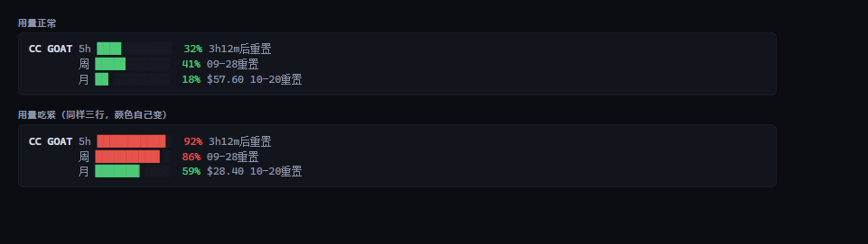

# Command Code 额度

在你**已经打开的编码 agent 里**直接看到 **Command Code** 套餐还剩多少——
5 小时、每周、每月三条窗口，带重置时间。

跑在你本机、不经过模型，所以**查额度不消耗额度**。



```
CC GOAT │ 5h █▎░░░░░░░░ 12% 4h27m后重置 │ 周 █▏░░░░░░░░ 11% 09-27重置 │ 月 ▋░░░░░░░░░ 6% $66.03 10-20重置
```

[English](README.md) · [核实记录](docs/FINDINGS.md)

[](https://github.com/Jovan1666/commandcode-usage/actions/workflows/check.yml)

---

## 安装

每个 agent 的插件加载方式不同，所以各装各的。七个里有六个最终跑的是同一份核心脚本
（`core/cc-usage.mjs`）；DeepSeek Harness 那个保留了自己的数据层，原因见[目录结构](#目录结构)。

| Agent | 怎么装 | 常驻？ |
|---|---|---|
| **Claude Code** | `/plugin marketplace add Jovan1666/commandcode-usage` 再 `/plugin install commandcode-usage@commandcode-usage`，然后 `node ~/.claude/plugins/marketplaces/commandcode-usage/plugins/claude-code/scripts/setup.mjs` | ✅ 状态栏 |
| **Codex CLI** | 插件市场（`.agents/plugins/marketplace.json`），自带的钩子每轮触发；Codex 会先问你信不信任它 | ⚠️ 每轮一行 |
| **Grok Build** | `grok plugin marketplace add Jovan1666/commandcode-usage`，然后跑 `plugins/grok/scripts/setup.mjs` | ✅ 状态栏 |
| **opencode** | 跑 `plugins/opencode/scripts/setup.mjs` | ✅ 侧栏 |
| **pi** | `pi install ./commandcode-usage/plugins/pi`，或把 `index.ts` 拷进 `~/.pi/agent/extensions/` | ✅ 输入框上方 |
| **DeepSeek Harness** | 克隆本仓库后 `dsh plugin --profile web add ./commandcode-usage/plugins/dsh`（要求 dsh `^0.1.5-rc.1`） | ✅ 侧栏 |
| **ZCode** | `/plugin marketplace add Jovan1666/commandcode-usage` 再 `/plugin install command-code-usage`（它的市场名和插件名都跟 Claude Code 那边不一样） | ⚠️ 只能按需调用 |

全程不需要你填 API key——脚本自己去找，见[凭证](#凭证)。

DeepSeek Harness 那张卡片有三态截图，在
[`plugins/dsh/assets/screenshot.png`](plugins/dsh/assets/screenshot.png)——折叠角标、浅色展开、深色展开。
其余五个平台渲染的都是上面那一行，所以只给文字、不另配图。


### 为什么有两个平台要多跑一个 setup

Claude Code 和 Grok 把状态栏放在**用户自己的配置**里，而且都不允许插件声明它
（Claude Code 的插件 `settings.json` 只认 `agent` 和 `subagentStatusLine`；
Grok 的插件格式里根本没有状态栏这一项）。所以最后一步是个脚本，替你写这一条设置。

它会先备份；发现你已经有一个别人写的状态栏时会**拒绝覆盖**，要你显式加 `--force`；
`--remove` 会把你的原状态栏**还原回去**。

## 显示什么

| 窗口 | 含义 | GOAT 档 |
|---|---|---|
| 5 小时 | 滚动突发上限——一次长会话掏不空整个月 | $14 |
| 每周 | 滚动 7 天上限 | $35 |
| 月度 | 计费周期内的额度 | $70 |

每条显示**已用百分比**、进度条、**重置时间**（一天内给倒计时，超过一天给日期）。
月度那条额外显示剩余金额。

颜色跟着用量走：低于 60% 绿、到 85% 黄、再高变红。（终端面板和 HTML 面板用更早的
50 / 80 分档——状态栏是那个为"余光扫一眼"调过的，所以报警更晚。）

没有滚动窗口的套餐（Provider、Enterprise）只显示余额。
没有 API 权限的套餐（Go）在状态栏里什么都不显示——不报错、也不留空位；
但你主动要终端面板时它会**如实报错**，因为那是你直接问的问题，沉默反而是错的。

## 没在用的时候它会自己藏起来

如果你配了 Command Code 却切到了别的模型，常驻的额度条就是噪音。
脚本会**逐轮**判断这个会话到底有没有走它：

1. **本地路由自己的映射** —— `cc-switch` 这类工具会把
   `ANTHROPIC_DEFAULT_OPUS_MODEL` / `..._MODEL_NAME` 成对写进环境变量，
   脚本读这对值就知道真实上游是谁。这是路由自己的配置，不是推测。
   （这条属于[推断而非实测](docs/FINDINGS.md)——万一拿不到，脚本会往下走而不是乱猜。）
2. **宿主直接给的模型名。** Codex 的钩子把 `model` 作为纯字符串给（`"gpt-5.6-terra"`），
   而且它的 `transcript_path` 是空的——没有这一级，Codex 永远判不出结果。
   Claude Code 这里给的是对象，会直接跳到第 3 级。
3. **会话记录** —— 每条消息实际用的模型（Claude Code 的 `message.model`、Grok 的 `modelId`）。
4. **账号活跃度** —— 兜底，只在前三条都给不出结论时用。

拿到的真实模型名去对照 Command Code 的公开模型目录（`/provider/v1/models`，免鉴权）。
不在目录里 → 隐藏。

有些模型名天然有歧义（`claude-opus-5` 原生 Anthropic 和 Command Code 目录里都有），
这种情况**故意不猜**——用 `--model <子串>` 自己补。

## 命令

Claude Code、Codex、Grok、ZCode 还会装一个 `/quota` 命令，打印紧凑面板。
**这个会经过模型**——它是提示词模板，要花一轮对话；状态栏才是免费的那条路，
`/quota` 是给"想让数字留在对话记录里"用的。

pi 用的是 `/ccq-bar on|off|toggle|refresh|status`（扩展自己处理，不走模型），
opencode 则完全没有命令——它的侧栏就是全部界面。

## 凭证

自动查找，顺序如下：

1. `COMMAND_CODE_API_KEY` / `COMMANDCODE_API_KEY` / `CMD_API_KEY`
2. 名字里含 `commandcode` 的任何环境变量
3. `~/.commandcode/auth.json`（官方 CLI 的登录态）
4. 你这个 agent 自己配置里的 Command Code provider 路由
   （`~/.zcode/…`、`~/.config/opencode/…`、`~/.claude/settings.json`、`~/.pi/agent/…`）
5. dsh / Codex / Grok 的 `config.toml` 或 `settings.yaml`，含 `apiKeyEnv` 的二次解析

全都找不到时状态栏**直接不渲染**——它不会把错误打到你的编辑器里。


> **一个例外：** DeepSeek Harness 适配器（`plugins/dsh`）保留了自己那套数据层，
> 没有引用 `core/cc-usage.mjs`。它的 host/client 两半和 141 项离线校验都是按那套契约写的，
> 所以暂时原样保留。详见 `plugins/dsh/README.md`。

## 目录结构

```
core/cc-usage.mjs        ← 唯一实现；其它都是同步出来的副本
scripts/sync-core.mjs    ← 把 core 同步到各适配器（--check 给 CI 用）
docs/FINDINGS.md         ← 核实了什么，以及官方变更时要跟着改什么
plugins/<agent>/         ← 每个平台一个薄适配器
```

适配器是**副本不是依赖**，所以每个都自包含、不需要包管理器就能装。
**只改 `core/`，不要改副本**，然后跑 `node scripts/sync-core.mjs`。

## 环境要求

- Node 18+（脚本用；适配器本身不需要别的）
- 有 API 权限的 Command Code 套餐——$1 的 Go 档没有
- **Windows**：装了 Git Bash 时 Claude Code 经它调用状态栏命令，没装则走 PowerShell。
  Git Bash 本身每次重绘约 29ms，PowerShell 大约是它的三倍——所以嫌状态栏迟钝就装 Git Bash。

## 关于"按当前速度会超限"的预警

脚本会算一个速度外推。**状态栏和 Codex 钩子里永远不显示它**；终端面板、`--compact`、
`--md`、`--html` 仍会打印，`--json` 里也一直有。

不让它进状态栏是有原因的：短样本外推几乎每次都会说"你要超了"——5 小时窗口刚开 25 分钟时，
一段正常的使用就能推出 140%——而一条永远亮着的警告等于没有警告。这些面板本来就是你主动
要来看的，多一行不碍事。

## 参与开发

```sh
node scripts/check.mjs          # 全部检查：同步、渲染、隐藏逻辑、密钥、dsh 的 141 项
node scripts/check.mjs --quiet  # 每个套件只打一行
```

这就是 CI 跑的那份脚本，本地过了线上就是绿的。dsh 那套要先装 React，见 `plugins/dsh/README.md`。

**只改 `core/cc-usage.mjs`。** 各适配器里的副本是生成的；改完 core 跑一次
`node scripts/sync-core.mjs`（或者让检查告诉你忘了同步）。

## 许可

MIT —— 见 [LICENSE](LICENSE)。
